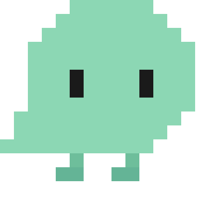
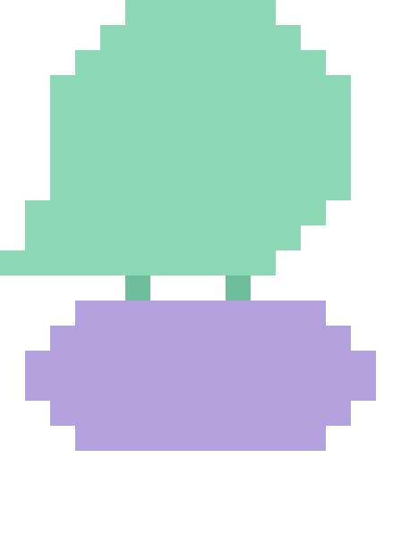
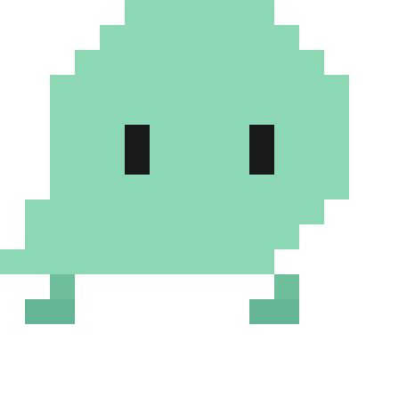

# dots-pet

一只薄荷绿的像素桌面宠物，住在你的屏幕上。

   

## 运行

```bash
pip install PyQt6 requests
python green_pet.py
```

## 它会做什么

**自己做的事**：眨眼、散步、爬到屏幕顶部倒挂然后掉下来、自言自语、打瞌睡（60秒没人理就盖毯子睡觉）

**你可以做的事**：

| 操作 | 效果 |
|------|------|
| 点一下 | 看你一眼，说句话 |
| 双击 | 打开聊天框 |
| 拖着走 | 慌张蹬腿 |
| 右键 | 全部功能 |

## 右键菜单

- **聊天** — 接入LLM，支持多轮对话、流式响应、富文本面板
- **喂食** — 苹果/茶/蛋糕/寿司/汉堡，吃完开心跳几下
- **猜拳** — 赢了不服气，输了蹦跶
- **藏猫猫** — 躲到屏幕边缘，10秒内找到它
- **番茄钟** — 自定义专注时间，到了跑到鼠标旁边通知你
- **喝水提醒** — 每30分钟喊你一次
- **跟随模式** — 跟着鼠标跑 / 自己玩
- **今日运势** — 从大吉到宜早睡

## 技术

Python + PyQt6。16x16像素手绘，macOS全屏置顶，透明窗口点击穿透。
