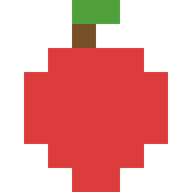
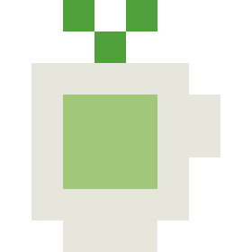
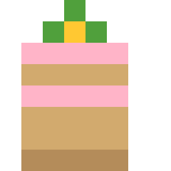
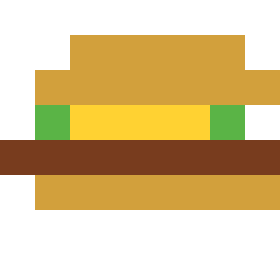

# 点点 DianDian — 你的像素桌面小伙伴

一只薄荷绿的水滴形像素小生物，住在你的屏幕上，陪你工作、摸鱼、发呆。

   

## 安装（macOS）

1. 双击 `DotsPet.dmg` 打开磁盘映像
2. 把 **dots-pet** 拖进 **Applications** 文件夹
3. 双击打开 dots-pet，系统会弹安全提示，**先关掉没关系**
4. 打开 **系统设置 → 隐私与安全性**，往下滑找到「已阻止打开 dots-pet」，点 **仍要打开**
5. 输入密码确认，点点就来了

> 只有第一次需要这样操作，之后可以正常双击启动。

## 开发

```bash
cd ~/projects/claude-pet
.venv/bin/python green_pet.py
```

打包成app：
```bash
.venv/bin/pyinstaller DianDian.spec --noconfirm
open dist/DianDian.app
```

---

## 和点点互动

### 基本操作

| 操作 | 效果 |
|------|------|
| **点一下** | 点点会看你一眼，跟你说句话 |
| **双击** | 唤出聊天输入框，和点点说话 |
| **拖着走** | 点点会慌张地蹬腿（但还是会跟你走的） |
| **右键** | 打开菜单，解锁全部功能 |

### 点点会自己做的事

- **眨眼**：每隔几秒眨一次
- **抬头看你**：鼠标移到点点上方远处，它会抬头望
- **自言自语**：隔一会儿冒出一句话
- **自己散步**：沿屏幕边缘走，爬到顶部倒挂，然后掉下来（"...好疼"）
- **自己吃东西**：偶尔给自己找点吃的
- **打瞌睡**：60秒没人理它就会说"有点有点累了"，然后盖上小毯子睡觉
- **工作提醒**：偶尔看一眼你的日志，提醒你该记录了、该出周报了

### 右键菜单功能

**聊天**
- 双击点点或右键→聊天，唤出输入框
- 接入内部LLM模型API，支持多轮对话
- 流式响应：API返回的`<visible>`思考内容会实时显示为思考词，无`<visible>`时fallback到"让我想想…"/"思考中…"
- 回复分短气泡和长面板两种形式
- 长面板支持富文本渲染：标题层级、标签行、用户评论引用、高亮块、代码块、图片、多列表格
- 图片点击可放大查看，同组图片支持左右箭头切换（hover淡入淡出）
- 长面板按Esc或点×关闭
- 多轮上下文自动管理：超过3分钟未聊天自动重置上下文，当作新对话
- 对话历史持久化：退出重启后右键→聊天可回看历史（最多15条），hover高亮，支持单条删除（×hover才显现）
- 新对话可重置上下文
- 每次API响应自动保存raw markdown到`chat_logs/`

**位置**
- 启动时自动IP定位城市，结果缓存到本地
- 右键→设置位置可手动覆盖（对话框预填当前城市），留空则重新自动定位
- 只在涉及吃喝玩乐的query中拼入位置信息，其他对话不干扰

**跟随模式**
- 「点点跟着我」：点点会跟着你的鼠标跑
- 「点点自己玩」：让它自由活动

**喂点点**

    

- 苹果、茶、蛋糕、寿司、汉堡，五种像素食物
- 食物会从旁边飘到点点嘴边，它吃完会开心跳几下

**猜拳**
- 石头剪刀布，点点会随机出
- 赢了它会不服气，输了会开心蹦跶

**藏猫猫**
- 点点会躲到屏幕边缘（右侧或顶部），只露出一点点
- 10秒内找到它点一下——"…被发现了"
- 超时它会自己出来——"你不来找我啊"

**今日运势**
- 随机抽一条运势，从"大吉！超级幸运"到"今天宜早睡"

**番茄钟**
- 自定义专注时间（1-120分钟，默认25）和任务内容
- 右上角显示倒计时
- 时间到点点会跑到你鼠标旁边通知你
- 休息10分钟后自动弹窗问要不要继续

**喝水提醒**
- 开启后每30分钟提醒一次
- 点点会跑到鼠标旁边喊你喝水
- 右键再点一次关闭

**散步 / 睡觉**
- 手动让点点去散步或睡觉
- 睡觉时会盖小毯子，飘出zzz

---

## 另一只：Clawd

项目里还有一只橘色的Clawd（`clawd_pet.py`），是点点的前身。功能少一些，多了个抛硬币，没有喂食、番茄钟、喝水提醒、藏猫猫和季节粒子。

```bash
# Electron版本（橘色Clawd）
npm start

# Python版本（橘色Clawd）
.venv/bin/python clawd_pet.py
```

---

## 技术

- Python + PyQt6，纯像素手绘，没有外部图片资源
- 16×16网格逐像素定义角色和食物
- macOS全屏置顶（通过ObjC runtime）
- 透明窗口 + 区域mask实现点击穿透
- 数据持久化：聊天历史存`~/Library/Application Support/DianDian/`（打包后）或项目目录（开发时）
- 自动IP定位 + 智能位置注入（仅吃喝玩乐类query）+ 定位缓存
- 多轮对话3分钟TTL自动重置
- PyInstaller打包为macOS .app
